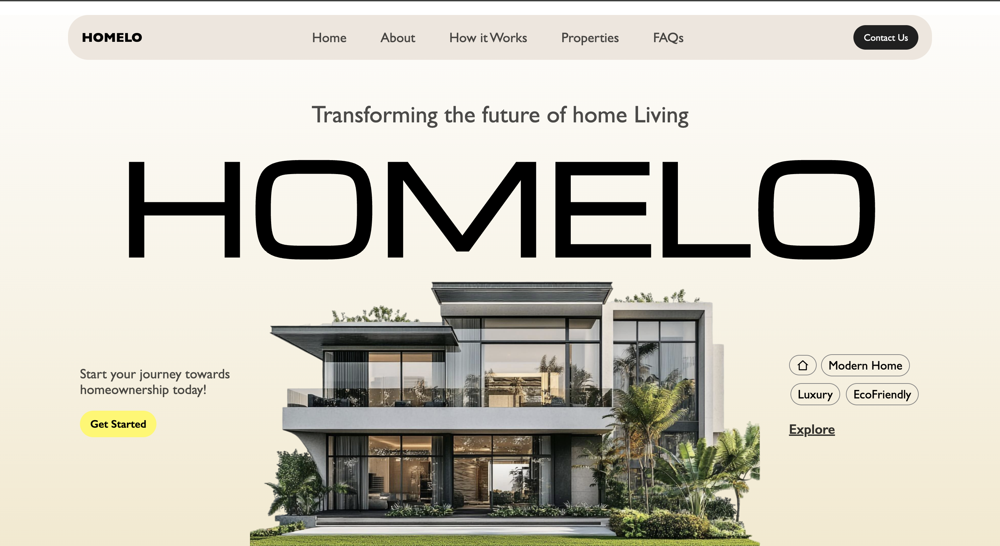

# 🏠 HOMELO Landing Page

A clean and modern landing page for **HOMELO**, a real estate brand.  
This project was built using **HTML** and **CSS**, showcasing layout and positioning concepts with a simple yet elegant design.

---

## 🌟 Features

- Stylish navigation bar with links and contact button  
- Hero section with bold typography  
- Gradient background design  
- Luxury villa showcase image  
- Tag section with icons and buttons  
- Call-to-action section  

---

## 🛠️ Technologies Used

- **HTML5**  
- **CSS3**  
- **Google Fonts** – Lexend Deca, Michroma, Poppins  
- **Remix Icon** – for elegant icons  

---

## 📁 Project Structure

homelo-landing-page/
│
├── index.html                  # Main HTML file
├── style.css                   # CSS styling
├── README.md                   # Project documentation
└── assets/                     # Folder containing images
    ├── modern-luxury-villa-architectural-design.png
    └── homelo-screenshot.png


---

## 📸 Screenshot

  
*(Preview of the final landing page design)*

---

## 🌐 Live Demo

Check out the live version here:  
👉 [https://dev-hamza03.github.io/homelo-landing-page/](https://dev-hamza03.github.io/homelo-landing-page/)

---

## 💻 How to Run Locally

1. Clone this repository:
   ```bash
   git clone https://github.com/dev-hamza03/homelo-landing-page.git
   ```

2. Navigate into the folder:
```
cd homelo-landing-page
```

3. Open the file:
   ```
   index.html
   ```
   
4. Run it in your web browser.


## 👨‍💻 Author

**Hamza Khan**  

- GitHub: [https://github.com/dev-hamza03](https://github.com/dev-hamza03)
